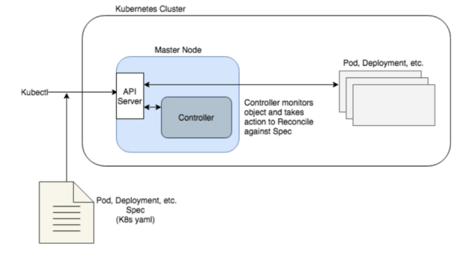
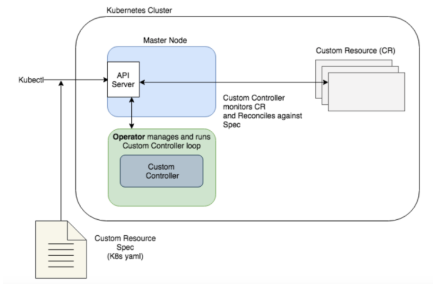
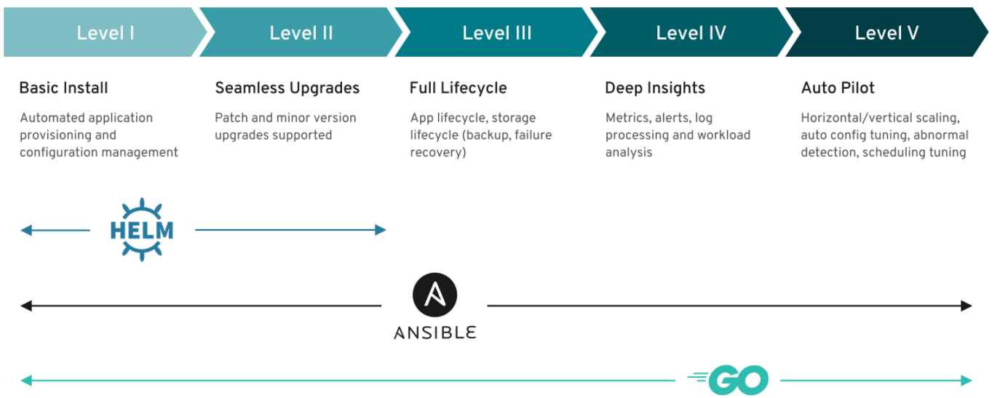

# operator
## controller란
- api server를 감시하여 선언된 api에 맞게 원하는 상태로 만들어주는 컴포넌트

## custom controller란
- 일반적인 service, deployment 등이 아닌 **custom resource** 를 처리하는 컴포넌트 

```
crd와 cr을 사용하여 만든 커스텀 리소스는 etcd에 올라가는 구조화된 데이터일 뿐입니다.  
커스텀리소스를 이용해서 원하는 동작을 하기위해서는 커스텀 컨트롤러가 필요합니다.  
커스텀 리소스를 이용하여 사용자가 원하는 상태를 선언하면(etcd에 올라가면) 커스텀 컨트롤러가 그 상태를 맞추기 위해 동작하게 됩니다.  
```
<details><summary>k8s의 아키텍처 및 동작</summary>
<p>
[Controller]<br>


[Custom Controller]  

</p>
</details>

## operator란
- CR의 컨트롤러 역할을 할 수 있는 쿠버네티스 API 서버의 클라이언트(개발 패턴, 익스텐션을 칭하기도한다.)
- k8s 컨트롤러 개념을 통해 쿠버네티스 코드를 수정하지않고 클러스터의 동작을 확장
- 컨트롤러의 역할을 할 뿐 아니라 쿠버네티스 운영에 필요한 모든것을 포함
```
오퍼레이터는 사용자 정의 리소스(CR)를 사용하여 애플리케이션과 그 구성 요소를 관리하는 컴포넌트입니다.
대략적인 구성 및 설정은 CR 내 사용자가 제공합니다.
k8s operator는 기본적으로 제공되는 Controller 이외의 추가적인 k8s관리 로직을 구현하기 위해 사용하며,
사용자 정의 리소스(CRD, CR, CC)을 사용하여 쿠버네티스 구성요소를 관리합니다.  
operator는 CR와 상호작용하는 정교한 Reconcil과정을 나타내며 복잡한 도메인 로직을 캡슐화하여 개발, 관리 할 수 있습니다.
```

## operator 개발방법
- client-go, controller-runtime, Metaccontroller 등의 Go 라이브러리로 밑바닥부터 개발
- 오퍼레이터 프레임워크 사용

## operator framework의 종류
- **Operator-SDK**
- kubebuilder
- KUBO


## operator 레벨
**operatorSDK에서 operator의 레벨을 아래와같이 정의하였습니다.**



<br>

level | 설명
---|---
1|자동화된 설치와 설정 관리
2|마이너버전 업데이트 지원
3|백업, 복구 등 어플리케이션 라이프사이클 지원
4|매트릭과, 알러트, 로그, 분석 툴 지원
5|자동 운영(수평-수직 확장, 이상감지 등)

<br>
operator-sdk는 HELM, ANSIBLE, GO를 사용하여 k8s의 확장을 편하게 할 수 있도록 도와줍니다.
